

  

  

  
  
  
  
  
  

  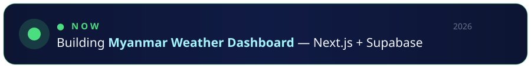

 

  

## 👋 About Me

  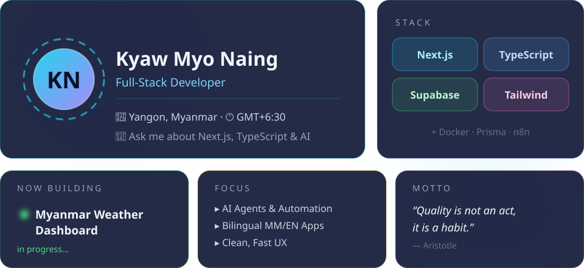

I turn ideas into polished, maintainable web applications — from product design and frontend UX to APIs, data, automation, and deployment. I build in both **မြန်မာ** and **English**.

  

## 📊 Stats

  

  

## 🛠️ Tech Stack

  

  

  Next.js · TypeScript · Prisma · PostgreSQL · Supabase · Tailwind CSS · AI & Automation

## ✨ Featured Projects

  <a href="https://t.me/zawgyiclawbot"></a>

  
  

  <a href="https://jobs.kmnapps.xyz"></a>

  
  

  <a href="https://imagine.kmnapps.xyz"></a>

  
  

  <a href="https://feature.kmnapps.xyz"></a>

  
  

  <a href="https://linpyaecafe.kmnapps.xyz"></a>

  
  

<table>
  <tr>
    <td width="50%" valign="top">
      <h3>☀️ Myanmar Weather Dashboard</h3>
      
Beautiful bilingual (မြန်မာ/English) weather platform with AI climate prediction &amp; analysis.

      
<a href="https://myanmar-weather-dashboard.onrender.com/">🚀 Live Demo</a> · <a href="https://github.com/mymyanmarland/myanmar-weather-dashboard">📦 Source</a>

    </td>
    <td width="50%" valign="top">
      <h3>🌻 Plants vs Zombies — Myanmar Edition</h3>
      
အပင်များ vs ဖုတ်များ 🧟 — HTML5 tower-defense game, 10 levels + endless mode.

      
<a href="https://github.com/mymyanmarland/pvz-myanmar-game">📦 Source</a>

    </td>
  </tr>
  <tr>
    <td width="50%" valign="top">
      <h3>👻 3D Horror Game</h3>
      
Survival horror with 3D-style graphics, 10 tense levels and atmospheric audio.

      
<a href="https://muse.ai/s/horror-game-xjb61kxaqxitxu3">🎮 Play Now</a> · <a href="https://github.com/mymyanmarland/horror-game">📦 Source</a>

    </td>
    <td width="50%" valign="top">
      <h3>🌸 Perfume Decant Shop</h3>
      
Bilingual e-commerce for authentic perfume decants — 5ml &amp; 10ml, MM/EN.

      
<a href="https://perfume-decant-shop.onrender.com/">🚀 Live Demo</a> · <a href="https://github.com/mymyanmarland/perfume-decant-shop">📦 Source</a>

    </td>
  </tr>
  <tr>
    <td width="50%" valign="top">
      <h3>🔄 n8n Workflows Catalog</h3>
      
Discover and share automation workflows.

      
<a href="https://n8nworkflows.xyz/">🌐 Website</a> · <a href="https://github.com/mymyanmarland/n8nworkflows.xyz">📦 Source</a>

    </td>
  </tr>
</table>

  

  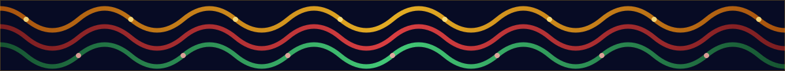

  

## 🤝 Let's Connect

  
  
  

 

  

  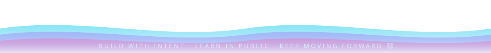

